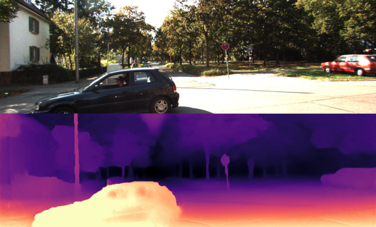

# ConvDepth

This is the reference PyTorch implementation for training and testing self-supervised monocular depth estimation models using the method described in our manuscript:

> **ConvDepth: Self-Supervised Monocular Depth Estimation for Autonomous Driving**
> 
> Wei Xiong, Yibo Chen, Jie Li, Long Chen, Qin Zou, Song Wang

which has been submitted to and is currently being considered for possible publication in **_IEEE Transactions on Intelligent Transportation Systems_** (T-ITS).

<p align="center">
  
</p>

## Setup

Our experiments were conducted using PyTorch 1.8.2, CUDA 11.1, and Python 3.8 on Ubuntu 20.04. You can install the dependencies with the following scripts:

```shell
conda create -n convDepth anaconda python=3.8
conda activate convDepth
conda install pytorch=1.8.2 torchvision torchaudio cudatoolkit=11.1 -c pytorch-lts -c nvidia
pip install opencv-contrib-python
pip install ultralytics-thop
```

## Dataset

You can download the entire [raw KITTI dataset](http://www.cvlibs.net/datasets/kitti/raw_data.php) by running:

```shell
wget -i splits/kitti_archives_to_download.txt -P kitti_data/
```

Then unzip with:

```shell
cd kitti_data
unzip "*.zip"
cd ..
```

**Warning:** The entire dataset has an approximate size of **175GB**; please ensure you have sufficient disk space available for extraction as well.

Our default settings assume that you have converted the PNG images to JPEG using the following command, **which also deletes the raw KITTI `.png` files**:

```shell
find kitti_data/ -name '*.png' | parallel 'convert -quality 92 -sampling-factor 2x2,1x1,1x1 {.}.png {.}.jpg && rm {}'
```

Alternatively, you may choose to skip this conversion step and train directly from the raw PNG files by adding the flag `--png` during training, though this will result in slower load time.

The above conversion command generates images consistent with our experiments, in which KITTI `.png` images were converted to `.jpg` on Ubuntu 16.04 using the default chroma subsampling setting of `2x2,1x1,1x1`. We observed that Ubuntu 18.04 defaults to `2x2,2x2,2x2`, resulting in different outcomes. Therefore, we specified the chroma subsampling parameter explicitly in the conversion command.

You may also store the KITTI dataset in any location of your choice and specify its path using the `--data_path` flag during training and evaluation.

**Splits**

The train/test/validation splits are specified in the `splits/` folder. By default, the code will train a depth model using [Zhou's subset](https://github.com/tinghuiz/SfMLearner) of the standard Eigen split of KITTI, which is designed for monocular training. Alternatively, you can train a model using the new [benchmark split](http://www.cvlibs.net/datasets/kitti/eval_depth.php?benchmark=depth_prediction) or the [odometry split](http://www.cvlibs.net/datasets/kitti/eval_odometry.php) by setting the `--split` flag.

## Training

```shell
python train.py --model_name mono_model_name
```

## Evaluation

For the KITTI dataset:

```shell
python evaluate_depth.py --load_weights_folder ~/tmp/mono_model/models/weights_19/ --eval_mono
```

For the Make3D dataset:

```shell
python evaluate_make3d_depth.py
```

## Pre-trained Models

- [BaiduNetdisk] Link: https://pan.baidu.com/s/1XcBivefkYicdGTbkf0bWdw?pwd=vuqj
- [Google Drive] Link: https://drive.google.com/file/d/1iRgyNz4xUinpnzXdE_e76IPzgF7nkgQS/view?usp=sharing
